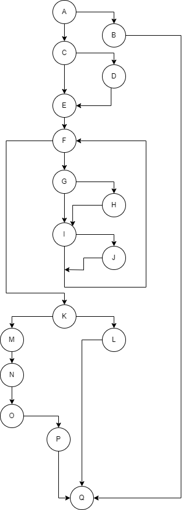

# Втора лабораториска вежба по Софтверско инженерство
## Моника Спасовска, бр. на индекс 186012

### Control Flow Graph

### Цикломатска комплексност
Цикломатската комплексност на овој код е 11, истата ја добив преку формулата **E-N+2*P**, каде што Е(edges)=22, N(nodes) = 17 и P(exit points)=3. Во случајoв 22-17+2*3 = 11 = цикломатската комплексност.

### Тест случаи според критериумот Every statement
....

### Тест случаи според критериумот Every path
....

### Објаснување на напишаните unit tests
... ...
